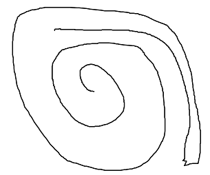

```{r setup, include=FALSE}
```

## 課題1 プログラム上での画像の扱い

``` python
import numpy as np
from PIL import Image
from pylb2kadai import d_fpath

###
### read csv file and convert it to png image file
###

# load sea_missing
d = np.loadtxt(
    d_fpath["sea_missing"], delimiter=",", dtype="float32"
)
d = d.astype(np.uint8)

# output as png file
im_out = Image.fromarray(d)
with open(d_fpath["out_sea_missing_png"], "wb") as f:
    im_out.save(f, format="PNG")

```

このようにブロックに入れてasisで出力する.

```{r results="asis", echo=T}

cat("")

```


## 課題2: SVTアルゴリズムの実装

``` python
import numpy as np
from sklearn.preprocessing import StandardScaler
print("kadai_2.py:" + __name__)

### 
### SVT algorithm function
###

class SVT:
    def __init__(self, target_data, masking_data, params):

        self.params = params
        self.masking_data = masking_data
        if not np.all(np.logical_or(
            masking_data == 1, masking_data == 0)
            ):
            raise ValueError(masking_data)
        self.m = masking_data.sum()

        self.target_data = target_data
        self.n1 = target_data.shape[0]
        self.n2 = target_data.shape[1]
        # params
        if params is None:
            params = dict()
        
        # tau
        if "tau_coef" in params.keys():
            self.tau_coef = float(params["tau_coef"])
        else:
            self.tau_coef = 2.5
        self.tau = self.tau_coef * (self.n1 + self.n2)
        # delta
        if "delta_coef" in params.keys():
            self.delta_coef = float(params["delta_coef"])
        else:
            self.delta_coef = 1.2
        self.delta = self.delta_coef * self.n1 * self.n2 / self.m
        # k_max
        if "k_max" in params.keys():
            self.k_max = int(params["k_max"])
        else:
            self.k_max = 1000
        
    def _mask(self, M):
        """
            m : numpy.ndarray
        """
        return self.masking_data * M
    
    def step(self, Y):
        """
            SVT algorithm one step
        """
        ############### 内容1
        ### low rank approximation
        U, S, VT = np.linalg.svd(Y, full_matrices=False) # must be full_matrices=False
        Stilde = np.diag(np.maximum(S-self.tau, 0))
        X = np.matmul(np.matmul(U,Stilde), VT) # np.diag is necessary
        ############### 内容2
        ### error reduction
        YY = Y + self.delta * (self._mask(self.target_data - X))
        return X, YY
    
    ############### 内容3
    def run(self, Y0 = None, verbose=True):
        if Y0 is None:
            Y0 = np.zeros(self.masking_data.shape)
        Y = Y0
        for k in range(self.k_max):
            X, Y = self.step(Y)
            if verbose:
                print(k, " th step")
                print("sum(X) = ", X.sum(), ", sum(Y) = ", Y.sum())

        return X
        
```
